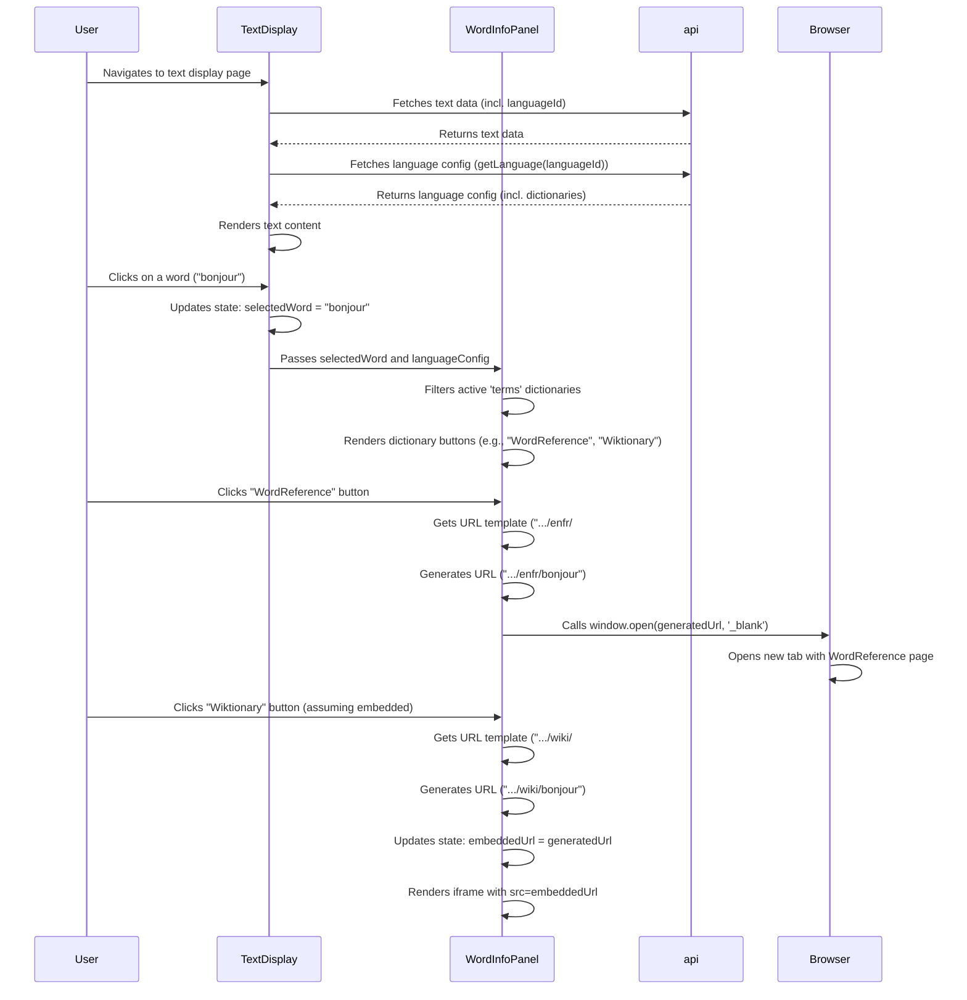

# Plan: Implement "Languages Tab" Feature

**Goal:** Implement a feature allowing users to add, delete, and configure languages within the LinguaRead application. Configuration includes dictionaries, sentence splitting rules, character handling, display options, and parser types, supporting various scripts including CJK.

**Approach:** Utilize dedicated database tables for maximum structure and flexibility. Implement all requested configuration fields, provide sensible defaults for key languages, link the dynamic list of languages available for translation, and lay the groundwork for different text parsing strategies.

---

## Phase 1: Backend Setup (Database & API)

1.  **Database Schema Design:**
    *   Define new tables: `LanguageDictionaries`, `LanguageSentenceSplitExceptions`.
    *   Modify the existing `Languages` table.
    *   **Schema Diagram:**
        ```mermaid
        erDiagram
            Languages ||--o{ LanguageDictionaries : "has"
            Languages ||--o{ LanguageSentenceSplitExceptions : "has"
            Languages ||--o{ Books : "has (existing)"
            Languages ||--o{ Texts : "has (existing)"
            Languages ||--o{ Words : "defines vocabulary for (existing)"

            Languages {
                int LanguageId PK
                string Name UK
                string Code UK
                int WordsRead "statistic"
                bool ShowRomanization "(new)"
                bool RightToLeft "(new)"
                string ParserType "(new, e.g., spacedel, mecab, jieba)"
                string CharacterSubstitutions "(new)"
                string SplitSentences "(new, e.g., '.!?')"
                string WordCharacters "(new, regex pattern)"
                bool IsActiveForTranslation "(new)"
            }

            LanguageDictionaries {
                int DictionaryId PK
                int LanguageId FK "to Languages"
                string Purpose "(new, e.g., terms, sentences)"
                string DisplayType "(new, e.g., embedded, popup)"
                string UrlTemplate "(new, with ###)"  // Updated placeholder
                bool IsActive "(new)"
                int SortOrder "(new, for UI ordering)"
            }

            LanguageSentenceSplitExceptions {
                int ExceptionId PK
                int LanguageId FK "to Languages"
                string ExceptionString "(new, e.g., 'Sr.')"
            }
        ```
    *   **Notes:**
        *   `ParserType` identifies the tokenization strategy (crucial for CJK).
        *   `IsActiveForTranslation` replaces the hardcoded list in `TranslationController`.

2.  **Backend Model Implementation (.NET Core):**
    *   Update `server/LinguaReadApi/Models/Language.cs` with new fields and relationships.
    *   Create `server/LinguaReadApi/Models/LanguageDictionary.cs`.
    *   Create `server/LinguaReadApi/Models/LanguageSentenceSplitException.cs`.
    *   Update `server/LinguaReadApi/Data/AppDbContext.cs` with `DbSet` properties and relationship configurations.

3.  **Database Migration:**
    *   Generate a new EF Core migration script.
    *   Review and apply the migration (`dotnet ef database update`).

4.  **Seed Default Configurations:**
    *   Modify `server/LinguaReadApi/Data/DbInitializer.cs`.
    *   Add default values for new fields in `Languages` for existing entries (e.g., French, Spanish, English).
    *   Add default `LanguageDictionaries` and `LanguageSentenceSplitExceptions` for these languages (using `###` placeholder).
    *   Include basic entries for Japanese (`ja`) and Chinese (`zh`), setting appropriate `ParserType` (e.g., "mecab", "jieba") and `IsActiveForTranslation`.

5.  **API Controller (`LanguagesController`):**
    *   Create `server/LinguaReadApi/Controllers/LanguagesController.cs`.
    *   Implement CRUD endpoints:
        *   `GET /api/languages`: List all languages with full configuration.
        *   `GET /api/languages/{id}`: Get specific language details.
        *   `POST /api/languages`: Create a new language entry.
        *   `PUT /api/languages/{id}`: Update an existing language and its configurations.
        *   `DELETE /api/languages/{id}`: Delete a language and configurations.

6.  **Service Layer:**
    *   Implement `ILanguageService` and `LanguageService` for business logic and data access.

7.  **Update Translation Controller:**
    *   Modify `GET /api/translation/languages` in `TranslationController.cs` to query the `Languages` table (via `ILanguageService`) based on the `IsActiveForTranslation` flag.

---

## Phase 2: Frontend Implementation (React)

1.  **Create "Languages" Tab/View:**
    *   Add route `/settings/languages`.
    *   Create main component `src/components/settings/LanguagesPage.js`.
    *   Add link to navigation bar.

2.  **UI Components:**
    *   `LanguageList`: Displays languages, allows selection, includes "Add New".
    *   `LanguageForm`: Comprehensive form for add/edit.
        *   Inputs for `Name`, `Code`, `ParserType`, `CharacterSubstitutions`, `SplitSentences`, `WordCharacters`.
        *   Toggles/Checkboxes for `ShowRomanization`, `RightToLeft`, `IsActiveForTranslation`.
        *   Sub-component/section for managing `LanguageDictionaries`.
        *   Sub-component/section for managing `LanguageSentenceSplitExceptions`.
        *   Save/Cancel/Delete buttons.

3.  **API Integration:**
    *   Add functions to `src/utils/api.js` for the new `LanguagesController` endpoints.

4.  **State Management (Zustand):**
    *   Update/create a store (`languageStore.js`) for language state management (if needed beyond component state).

5.  **Integrate Translation List:**
    *   Update UI elements selecting translation languages to use the dynamic `GET /api/translation/languages` endpoint.

---

## Phase 3: Core Logic Integration - Dictionary Lookup

**Goal:** Integrate the configured dictionaries into the text reading view (`TextDisplay.js`) so users can look up selected words.

1.  **Identify Target Component:** `client/lingua-read-client/src/pages/TextDisplay.js` (and potentially a child component for the word info panel).
2.  **Fetch Language Configuration:**
    *   In `TextDisplay.js`, when text data (including `languageId`) is loaded, use the `getLanguage(languageId)` API function to fetch the full language configuration.
    *   Store the fetched `languageConfig` object in the component's state.
3.  **Identify Word Selection Logic:**
    *   Locate the state variable and update logic in `TextDisplay.js` that stores the currently selected word/term string (e.g., `selectedWord`).
4.  **Modify Word Info Panel:**
    *   Identify the component/JSX rendering the panel displayed when a word is selected.
    *   Pass the `selectedWord` string and the `languageConfig` object as props to this panel.
5.  **Render Dictionary Buttons:**
    *   Inside the panel component:
        *   Check if `selectedWord` and `languageConfig.dictionaries` are available.
        *   Filter `languageConfig.dictionaries` for entries where `isActive` is true and `Purpose` is 'terms'.
        *   Sort the filtered dictionaries by `SortOrder`.
        *   Map over the sorted, active dictionaries and render a `<Button>` for each.
        *   Button text can be generic ("Dict 1", "Dict 2") or attempt to derive a name from the URL (e.g., "WordReference").
6.  **Implement Button Actions:**
    *   Add an `onClick` handler to each dictionary button.
    *   In the handler:
        *   Get the dictionary's `UrlTemplate` and `DisplayType`.
        *   Get the `selectedWord`.
        *   Generate the final URL by replacing `###` in `UrlTemplate` with the (URL-encoded, if necessary) `selectedWord`.
        *   If `DisplayType` is 'popup', call `window.open(generatedUrl, '_blank')`.
        *   If `DisplayType` is 'embedded':
            *   Update a state variable (e.g., `embeddedUrl`) in the panel/`TextDisplay` component with the `generatedUrl`.
            *   Conditionally render an `<iframe>` below the buttons, setting its `src` to `embeddedUrl`.
            *   Provide a way (e.g., a close button) to clear `embeddedUrl` and hide the iframe.
7.  **State Management:** Add state variables for `languageConfig`, `selectedWord` (if not already present), and `embeddedUrl`.

**Visual Flow:**


---

*(Future Phase: Text Processing Integration - Details TBD)*
*   Modify backend text processing services to use `SplitSentences`, `LanguageSentenceSplitExceptions`, `WordCharacters`, `CharacterSubstitutions`.
*   Implement parser logic based on `ParserType`.